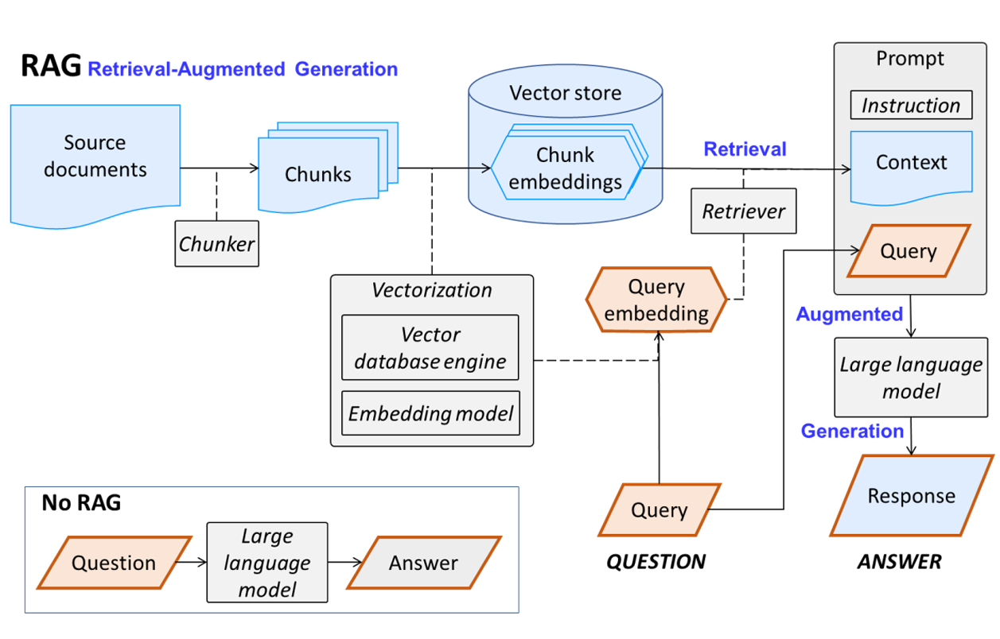
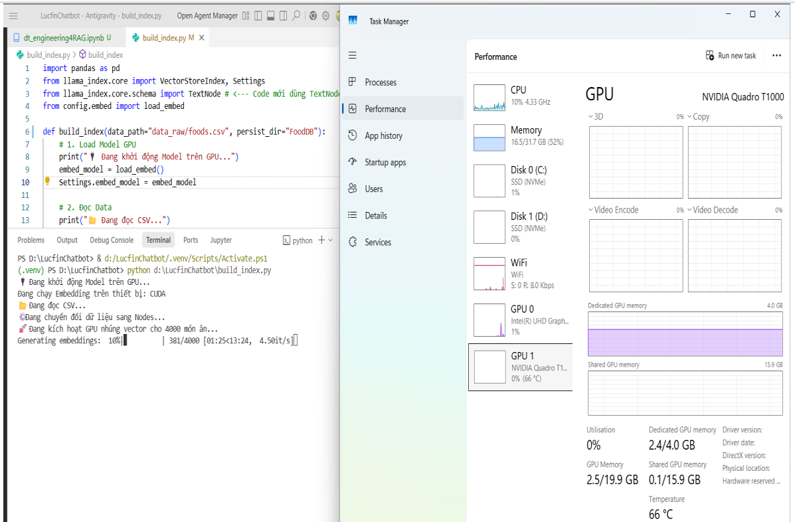
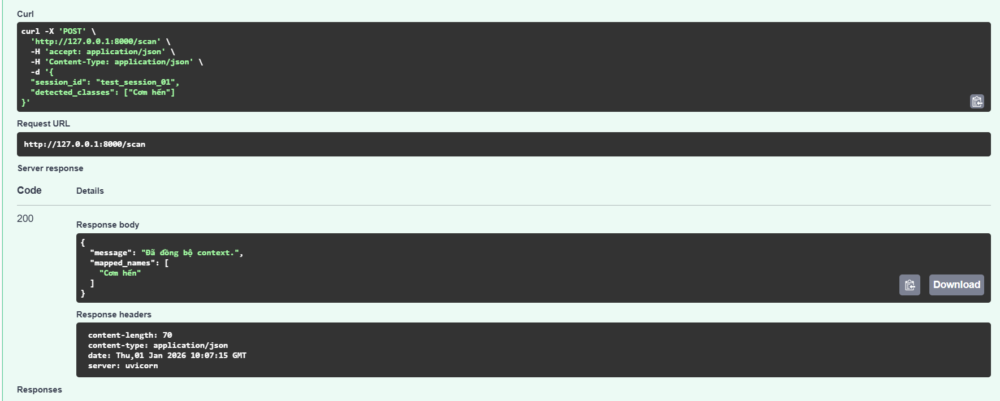
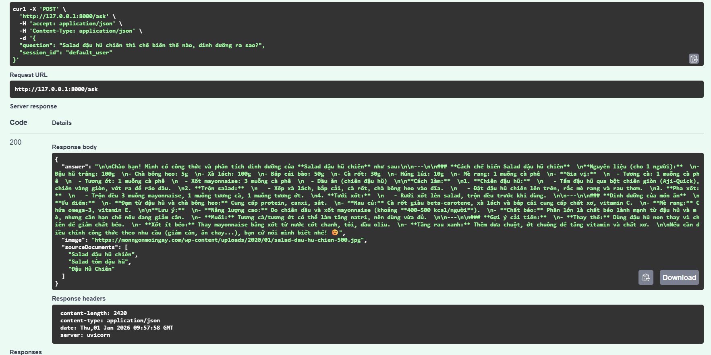
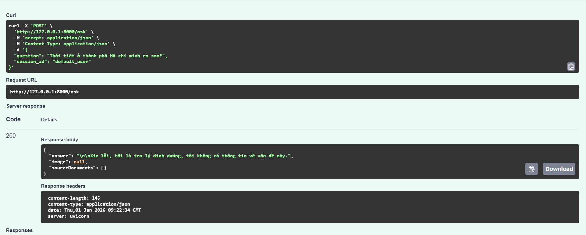
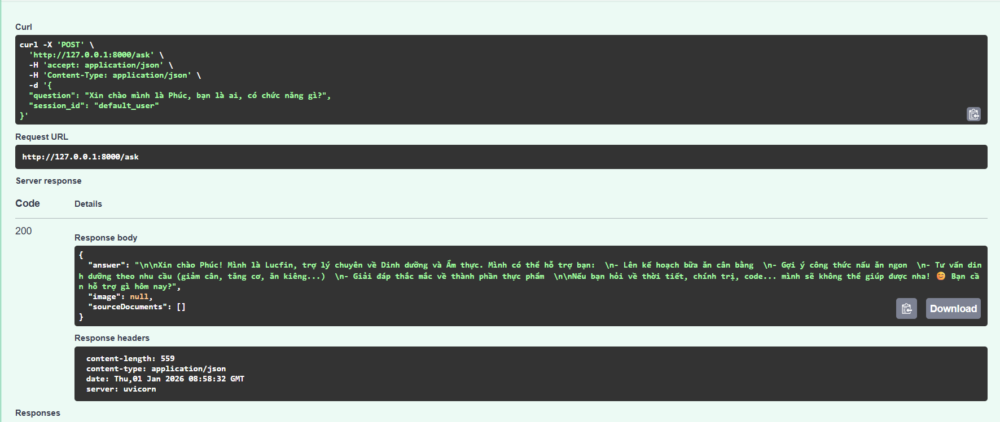

# 🍎 Lucfin Nutrition Assistant

> **An Adaptive Multimodal RAG System for Vietnamese Cuisine Nutrition Analysis.**

[](https://www.python.org/)
[](https://fastapi.tiangolo.com/)
[]()
[](https://www.android.com/)

**Lucfin** is not just a chatbot; it's an intelligent nutrition consultant powered by **Adaptive RAG (Retrieval-Augmented Generation)**. It combines Computer Vision (YOLO) for food recognition with a high-performance Vector Database to provide accurate, scientifically-backed nutritional insights for Vietnamese dishes.

---
## 🏗️ System with RAG and without RAG

System with just an LLM is not enough to provide accurate nutritional insights for Vietnamese dishes. And it will be hallucinated a lot. 
In this case, we use the system with implementation of RAG, it will be more accurate and reliable.
<p align="center">
  
  <br>
  <em>Figure 1: The Basic RAG Pipeline of Lucfin</em>
</p>

---
## 🏗️ System Architecture

Lucfin operates on a **3-Layer Pipeline** architecture designed to optimize latency and accuracy:

1.  **Layer 1 (Perception):** Android Client captures food images via Camera.
2.  **Layer 2 (Orchestration):** A **Semantic Router** classifies user intent (Vision Follow-up vs. Deep Knowledge vs. Chitchat).
3.  **Layer 3 (Cognition):**
    * 🔥 **Fast Track:** Direct injection of YOLO detection results.
    * 💧 **Deep Track:** Hybrid Retrieval (Vector + Keyword) + Cross-Encoder Re-ranking.
    * 🛡️ **Safety Track:** Guardrails for hallucination prevention.

<p align="center">
  
  <br>
  <em>Figure 2: The Adaptive Multimodal RAG Pipeline of Lucfin</em>
</p>


## 🏗️ Indexing Process

Lucfin uses **ChromaDB** as the Vector Database to store the documents. Besides, we use **LangChain** and **LlamaIndex** to build the index. The embedding model is **AITeamVN/Vietnamese_Embedding**.

<p align="center">
  
  <br>
  <em>Figure 3: The Indexing Process of Lucfin</em>
</p>


---

## 🚀 Key Features & Demo

We don't just claim it works; here is the proof of our **Backend (Uvicorn Logs)** synchronizing with the **Frontend (Android App)**.
**Get more details in the android application repository as the link below.**
[](https://github.com/Phuc75nguyen/NutriAI)

### 1. 👁️ Visual Intelligence (AI Camera)
**Capability:** Instantly recognizes Vietnamese dishes from images and injects context into the conversation without searching the database.

<p align="center">
  
  <br>
  <em>Figure 4: Visual Intelligence (AI Camera)</em>
</p>

### 2. 🧠 Deep Nutrition Knowledge (RAG)
**Capability:** answers complex nutritional queries (Calories, Protein, Fat) by retrieving and re-ranking documents from the internal Knowledge Base.

<p align="center">
  
  <br>
  <em>Figure 5: Deep Nutrition Knowledge (RAG)</em>
</p>

### 3. 💬 Smart Routing & Chitchat: case1: check_gaurdrail
**Capability:** The **Semantic Router** distinguishes between technical queries and casual conversation to provide natural responses.

<p align="center">
  
  <br>
  <em>Figure 6: Smart Routing & Chitchat: case1: check_gaurdrail</em>
</p>

---
### 4. 💬 Smart Routing & Chitchat: case2: check_unreliable_content
**Capability:** The **Semantic Router** distinguishes between technical queries and casual conversation to provide natural responses.

<p align="center">
  
  <br>
  <em>Figure 7: Smart Routing & Chitchat: case2: check_unreliable_content_weather</em>
</p>

---
### 5. 💬 Smart Routing & Chitchat: case3: check_normal_speaking
**Capability:** The **Semantic Router** distinguishes between technical queries and casual conversation to provide natural responses.

<p align="center">
  
  <br>
  <em>Figure 8: Smart Routing & Chitchat: case3: check_normal_speaking</em>
</p>

---

## 🛠️ Technology Stack

* **Core AI Engine:**
    * **LLM:** Qwen-3-32B (via Groq API) for high-fidelity generation.
    * **Embeddings:** `AITeamVN/Vietnamese_Embedding` (State-of-the-art for Vietnamese).
    * **Vision:** YOLOv11 custom trained on Vietnamese Food Dataset.
* **RAG Infrastructure:**
    * **Vector Store:** ChromaDB (Local & Efficient).
    * **Orchestration:** LangChain & LlamaIndex.
    * **Re-ranking:** Cross-Encoder for Context Precision.
* **Backend:** FastAPI (Python), Uvicorn.
* **Client:** Native Android (Java/XML)

---

## 📊 Performance Evaluation

The system was evaluated using the **Ragas Framework** (LLM-as-a-Judge) on a test set of 30 QA pairs:

* ✅ **Answer Relevancy:** **~95.7%** (High intent understanding).
* ✅ **Faithfulness:** **~94.5%** (Minimizes hallucination via Guardrails).
* ✅ **Context Precision:** **~91.2%** (Accurate retrieval).

---

## ⚙️ Installation & Setup

### Prerequisites
* Python 3.10+
* CUDA-enabled GPU (Optional, for faster Re-ranking)
* Groq API Key

### Steps

1.  **Clone the repository**
    ```bash
    git clone https://github.com/Phuc75nguyen/LucfinChatbot.git
    cd LucfinChatbot
    ```

2.  **Install dependencies**
    ```bash
    python -m venv .venv
    source .venv/bin/activate  # On Windows: .venv\Scripts\activate
    pip install -r requirements.txt
    ```

3.  **Setup Environment Variables**
    Create a `.env` file:
    ```env
    GROQ_API_KEY=gsk_your_key_here
    ```

4.  **Build Vector Index (First run only)**
    ```bash
    python build_index.py
    ```

5.  **Run the Server**
    ```bash
    python main.py
    ```
    *Server will start at `http://0.0.0.0:8000`*

---

## 👨‍💻 Author

**[Nguyen Tan Phuc]**
* Role: AI Engineer & System Architect
* Contact: phuc75nguyen@gmail.com
---
*Built with Team Phuc-Linh❤️ and lots of coffee.*